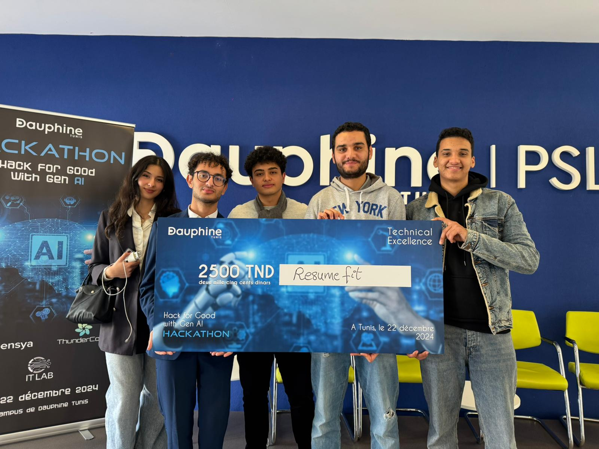
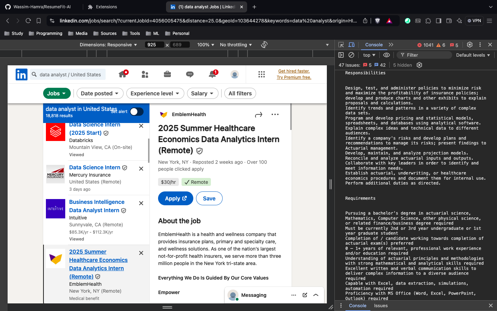
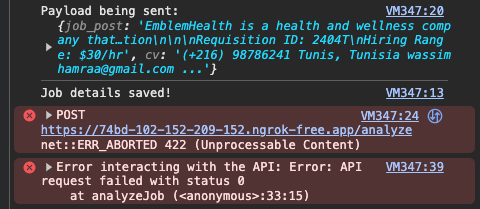
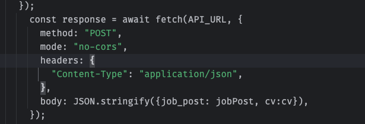

# **🥳 Post-Hackathon**

 

# **🚀 ResumeFit AI: End to End RAG Application**

## Notre solution est une extension Chrome qui facilite et optimise le processus de candidature en ligne. Grâce à l’extraction automatique des données des annonces et l’utilisation de techniques avancées comme la Recherche Augmentée (RAG) et les modèles de langage de grande taille (LLM), notre extension génère des recommandations personnalisées pour améliorer le CV.
  *  ***Demo link: [resumefit-ai.streamlit.app](https://resumefit-ai.streamlit.app/)***
  * **⚠️ Wake the Streamlit Application if it's sleeping**
## ***Extension Screenshots:***

##

## ***Architecture:***

* Extension : Une extension de navigateur analyse les CV (avec Pdf.js) et intercepte les offres d'emploi via un service worker. Ces données sont envoyées à une API.
* API (FastAPI + Ngrok) : Reçoit les données de l'extension (CV et offres d'emploi) et les envoie aux autres modules pour traitement.
* Splitter et Embeddings : Le texte des CV et des offres est découpé, puis transformé en données numériques (embeddings) grâce à un modèle Hugging Face.
* Vector Store (FAISS) : Stocke ces données pour rechercher les similarités entre CV et offres d'emploi.
* Retriever : Trouve les correspondances les plus pertinentes.
* LLM (Gemma 2) : Analyse les correspondances et génère des recommandations.
* Overlay : Affiche les recommandations directement dans l'extension.

## ***File Hierarchy:***

## ***API:***

### ***ngrok Tunnel:***

### ***Sending a POST requests with cv/job post info and getting respone from the api:***

### Terminal

## ***The Problem We faced***
#### The Extension is succesfully retrieving each posts' title, company name and description

#### Payload correctly configured

#### CORS: Cross-Origin Resource Sharing 
#### is a security feature implemented by web browsers to control how resources on a web page can be requested from another domain or origin.
#### CORS is designed to:
#### Protect users from malicious websites trying to steal sensitive data.
#### Ensure only trusted domains can access specific server resources.
#### Without CORS, any website could make requests to a server that the user is authenticated with (like their bank) and perform unauthorized actions.
### Our Solution

#### The problem lies in the mode: "no-cors" options when calling the api which  disables the access to the response details due to browser security policies.

### Team 
  * **khalil kassentini**
  * **zyneb mrad**
  * **mahdi bani**
  * **wassim hamra**
  * **yahya ben ahmed**
##

**Real-world solutions are ten times better than pointless complexity 😉**