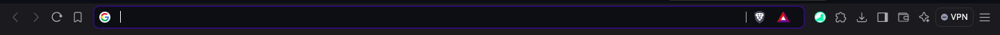
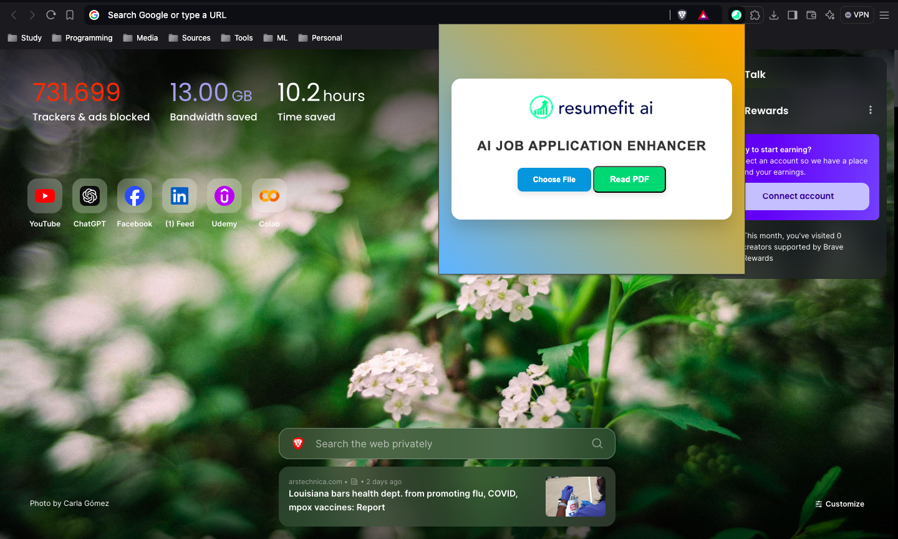
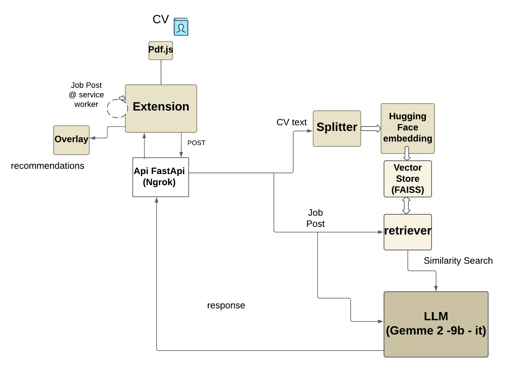
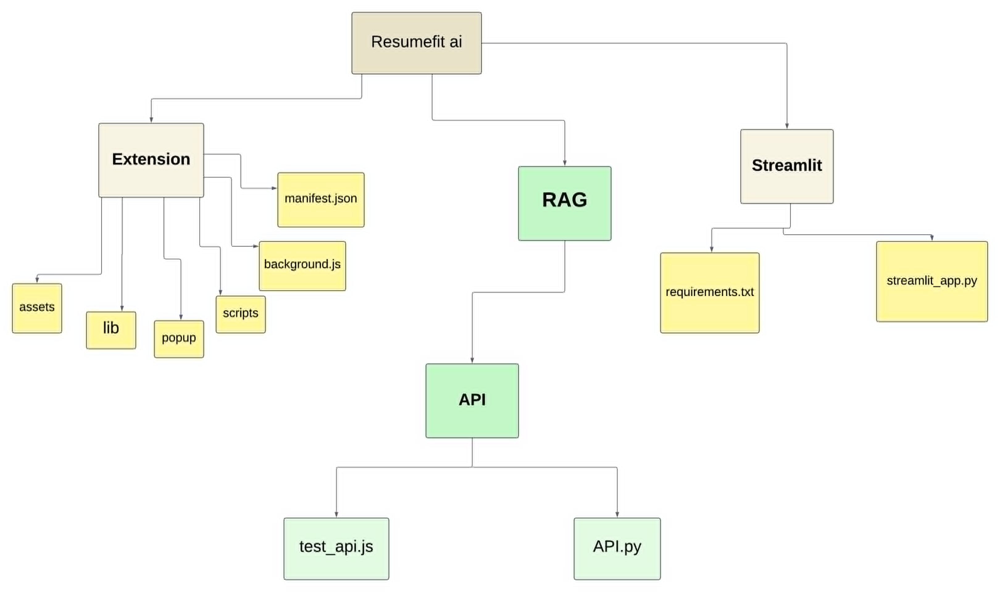
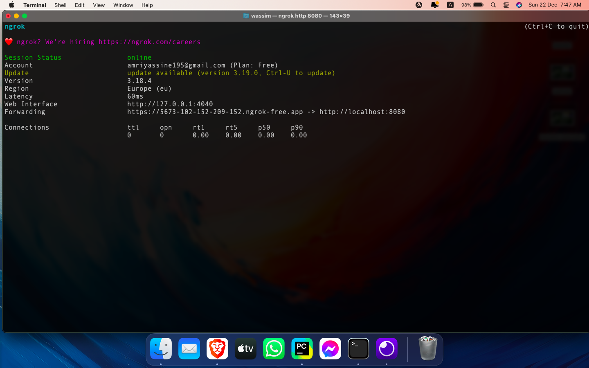
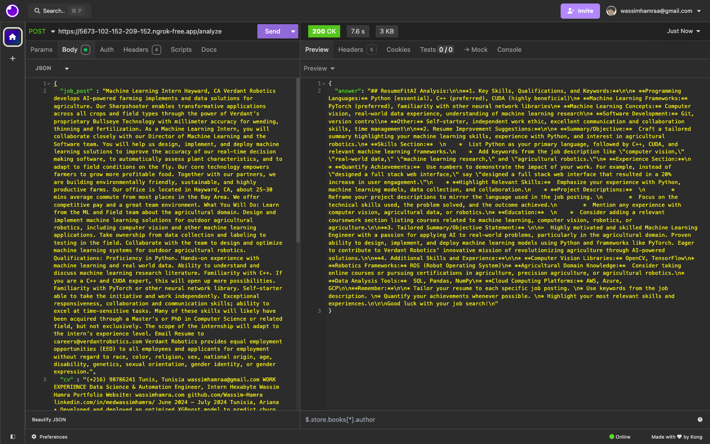
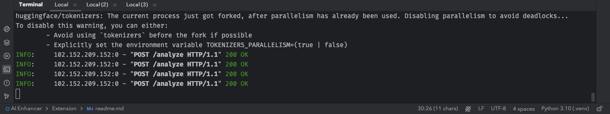

# **🚀 ResumeFit AI: End to End RAG Application**

## Notre solution est une extension Chrome qui facilite et optimise le processus de candidature en ligne. Grâce à l’extraction automatique des données des annonces et l’utilisation de techniques avancées comme la Recherche Augmentée (RAG) et les modèles de langage de grande taille (LLM), notre extension génère des recommandations personnalisées pour améliorer le CV.
  *  ***Demo link: [resumefit-ai.streamlit.app](https://resumefit-ai.streamlit.app/)***
  * **⚠️ Wake the Streamlit Application if it's sleeping**
## ***Extension Screenshots:***

##

## ***Architecture:***

## ***File Hierarchy:***

## ***API:***

### ***ngrok Tunnel:***

### ***Sending a POST requests with cv/job post info and getting respone from the api:***

### Terminal

### Team 
  * **khalil kassentini**
  * **zyneb mrad**
  * **mahdi bani**
  * **wassim hamra**
  * **yahya ben ahmed**
